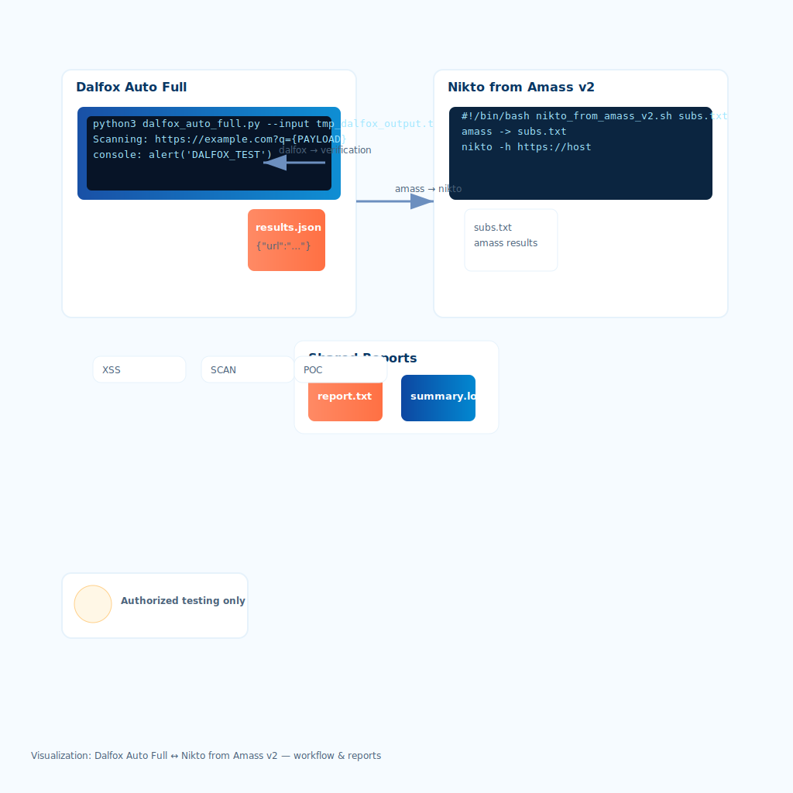

# nikto_from_amass_v2.sh — README

## Overview

`nikto_from_amass_v2.sh` is a small Bash automation script that reads a list of hostnames (for example, subdomains discovered by `amass`), determines whether each host serves HTTPS (falls back to HTTP), runs a `nikto` web scan against the chosen URL, and saves per-host output into a timestamped results directory. A summary log of all scans is also produced.

This script is meant to speed up straightforward bulk Nikto triage of many subdomains. **Only scan targets you are authorized to test.**

---

## Features

* Reads hosts from a plain text file (one host per line).
* Skips blank lines and comments (lines starting with `#`).
* Checks for HTTPS first (quick `curl --head` probe), falls back to HTTP.
* Runs `nikto` against each reachable URL and saves output per-host with timestamps.
* Creates a timestamped results directory.
* Produces a `summary.log` with per-host result status and output filenames.
* Prints colored progress/status messages to the terminal.

---

## Requirements

* Bash (script uses `set -euo pipefail` and POSIX utilities).
* `nikto` installed and available in `PATH`.
* `curl` installed and available in `PATH`.
* Common tools: `awk`, `sed`, `date`, `mkdir`, `basename` (standard on most Unix-like systems).

### Example installation hints

(Use the package manager appropriate for your system)

* Debian/Ubuntu:

```bash
sudo apt update
sudo apt install nikto curl
```

* Fedora/CentOS (EPEL may be required for nikto):

```bash
sudo dnf install nikto curl
```

* macOS (Homebrew):

```bash
brew install nikto curl
```

---

## Usage

### Basic

```bash
./nikto_from_amass_v2.sh /path/to/subdomains.txt
```

If you omit the argument, the script defaults to:

```
/home/amirhosein/Desktop/amass_results/unfxco.com/subs_.txt
```

### Output

By default, results are written under:

```
${HOME}/nikto_results/unfxco.com/<TIMESTAMP>/
```

Each scanned host produces a file:

```
<safe_host>_YYYYMMDD_HHMMSS.txt
```

and a single `summary.log` is created inside the results directory with scan status entries.

---

## Input file format

* Plain text file, one host per line. Example:

```
example.com
www.example.com
api.example.com
# comment line ignored
```

* Lines starting with `#` and empty lines are ignored.

---

## What the script does (step-by-step)

1. Set `set -euo pipefail`: fail on errors/undefined variables and on pipeline failures.
2. Determine `INPUT_PATH` from first script argument, or fall back to the built-in default.
3. Create a timestamped output directory inside `${HOME}/nikto_results/unfxco.com/<timestamp>`.
4. Validate that required commands (`nikto` and `curl`) exist; exit if missing.
5. Read each non-empty, non-comment line from the input file:

   * Normalize the hostname into `host`.
   * Build a timestamped, sanitized output filename.
   * Probe `https://$host` with a quick `curl --head --max-time 5`; if it responds, use HTTPS, otherwise fall back to HTTP.
   * Run `nikto -h "$url"` and append results to the host output file.
   * Log success/failure to `summary.log`.
6. Print a completion message pointing to the `summary.log`.

---

## Example output snippets

**Per-host file (`safe_host_20250101_121501.txt`)**

```
[URL] https://example.com
[Time] Wed Jan  1 12:15:01 UTC 2025
[Host] example.com

... nikto output ...
```

**`summary.log`**

```
[#] Nikto scan summary
[#] Date: Wed Jan  1 12:15:01 UTC 2025

[+] example.com (https://example.com) -> example.com_20250101_121501.txt
[-] other.example.com (http://other.example.com) [FAILED] -> other.example.com_20250101_121502.txt
```

---

## Environment & variables

* `INPUT_PATH` — script argument 1 (path to hosts file). Default hard-coded fallback used if not provided.
* `OUTDIR` — results directory, composed from `${HOME}/nikto_results/unfxco.com/$(date +%Y%m%d_%H%M%S)`. Change `unfxco.com` in the script if you scan a different domain.
* `SUMMARY_FILE` — `${OUTDIR}/summary.log`.

You can edit the script to parameterize domain (instead of hard-coded `unfxco.com`) or to accept an output directory argument.

---

## Customization ideas

* Accept a second parameter for the output base directory or project name, e.g.:

  ```bash
  ./nikto_from_amass_v2.sh subs.txt myproject
  ```
* Add concurrency (GNU `parallel` or background jobs) to speed up large lists — be careful with rate limits and legal permissions.
* Add retry logic or longer `curl` timeout for flaky hosts.
* Run `nikto` with custom options (e.g., `-Tuning` or `-Plugins`) — modify the `nikto -h "$url"` invocation.
* Compress results directory at the end (tar.gz).
* Add email or Slack notifications on completion.

---

## Safety & legal

**Only** scan hosts you have explicit permission to test. Unauthorized scanning can be illegal and unethical. Always follow your organization’s rules of engagement and local laws.

---

## Troubleshooting

* `nikto not found`: ensure nikto is installed and in your `PATH`.
* `curl not found`: install curl.
* If scans continuously fail for HTTPS but the site is actually HTTPS, try increasing curl timeout and verify network/DNS:

  ```bash
  curl -v --head --max-time 10 "https://$host"
  ```
* If you need verbose nikto output, run nikto manually against a sample host to tune options:

  ```bash
  nikto -h https://example.com -Display V
  ```

---

## Example: integrate with amass

Typical workflow:

1. Run amass to enumerate subdomains, save to `subs.txt`.
2. Run this script against `subs.txt`.

```bash
amass enum -d example.com -o amass_subs.txt
./nikto_from_amass_v2.sh amass_subs.txt
```

---

## License & attribution

Use as you see fit. If you integrate this script into a project, please keep an attribution comment (optional) or add your own license block at the top of the script.

---

If you want, I can:

* Add support for a CLI help/usage message and argument parsing,
* Make the results directory accept a project/domain argument instead of the hard-coded `unfxco.com`,
* Add optional concurrency or a dry-run mode,
* Or produce a smaller README formatted for GitHub with badges and required install commands. Which would you like next?
